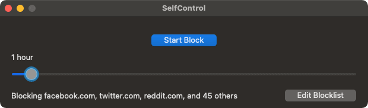

# [SelfControl][website]

    

## About

SelfControl is a free and open-source application for macOS that lets you block **your own** access to distracting websites, your mail servers, or anything else on the Internet. Just set a period of time to block for, add sites to your blocklist, and click "Start Block". Until that timer expires, you will be unable to access those sites—even if you restart your computer or delete the application.

## SelfControlX Fork Additions (this `v1` folder)

This fork keeps upstream behavior as the base and adds:

1. **Side-by-side identity isolation**: app/helper naming was split so this build can coexist with upstream SelfControl (`SelfControlX`, `org.eyebeam.selfcontrolxxd`).
2. **Trusted internet-time enforcement** for modern blocks (consensus-based trusted clock with strict expiry handling).
3. **Bypass hardening** during active blocks (hosts-file protection + automatic rule re-apply if tampering is detected).
4. **Extended duration controls**: max block length up to 7 days and configurable duration slider interval.
5. **Quick Block UX upgrades**: quick block controls on the main window and menu bar quick-duration actions.
6. **Trusted-time UI controls**: main-window trusted time display plus editable trusted-time source/consensus settings in Advanced preferences.
7. **Import preset management** in Edit Blocklist:
   - built-in presets (`Common Distracting Sites`, `News & Publications`),
   - save current list as a named custom preset,
   - remove custom presets,
   - hide/remove built-in presets,
   - reset built-in presets (with confirmation).
8. **Timer/block flow hardening** for active-block updates and extension paths (safer end-date validation and refresh behavior).

## Building With Xcode (This Fork)

Users should normally download releases from [our website][website]. For local development/building on your own Mac:

1. Install a recent Xcode.
2. Install Xcode Command Line Tools:
   - `xcode-select --install`
3. Install CocoaPods:
   - `sudo gem install cocoapods`
4. From this folder, install pod dependencies:
   - `cd "/path/to/SelfControlX"`
   - `pod install`
5. Open the workspace (not the project):
   - `open "SelfControl.xcworkspace"`
6. In Xcode:
   - Select scheme `SelfControl`
   - Select destination `My Mac`
   - Adjust signing settings if needed for local build
7. Build/Run (`Product` -> `Build` / `Run`).
8. To find the app binary:
   - `Product` -> `Show Build Folder in Finder`
   - Output app name is `SelfControlX.app`.

## Credits

Developed by [Charlie Stigler](http://charliestigler.com), [Steve Lambert](http://visitsteve.com), and [others](https://github.com/SelfControlApp/selfcontrol/graphs/contributors). Your contributions very welcome!

SelfControl is now available in 12 languages thanks to [the fine translators credited here](https://github.com/SelfControlApp/selfcontrol/wiki/Translation-Credits).

## License

SelfControl is free software under the GPL. See [this file](./COPYING) for more details.

[website]: https://selfcontrolapp.com/
